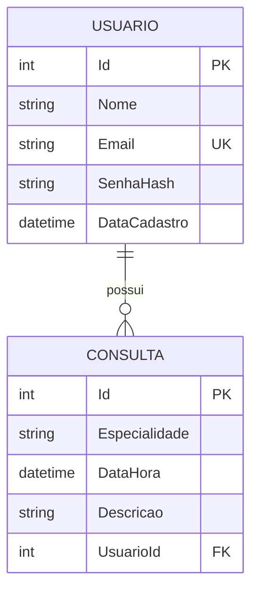

# Sistema de Gestão de Consultas UVV

Aplicação Web em **C#**, **ASP.NET Core MVC**, **Entity Framework Core Code First** e **SQL Server**. O sistema permite cadastro e autenticação de usuários e o CRUD completo das consultas pertencentes ao usuário conectado.

## Funcionalidades entregues

- cadastro de usuário por formulário `POST`;
- login e logout por autenticação em cookie;
- senha armazenada como hash com `PasswordHasher`, nunca em texto puro;
- criação, listagem, detalhes, edição e exclusão de consultas;
- relacionamento `Usuario 1:N Consulta` pela chave estrangeira `UsuarioId`;
- validações no servidor com Data Annotations e validação de data futura;
- isolamento de dados: um usuário não acessa consultas de outro usuário;
- rotas de consulta protegidas com `[Authorize]`;
- proteção CSRF nos formulários que alteram dados;
- documentação e teste de API por Swagger/OpenAPI;
- interface responsiva para computador e celular.

## Conferência dos requisitos

| Exigência | Implementação |
|---|---|
| MVC | `Controllers/`, `Models/` e `Views/` |
| EF Core Code First | `ApplicationDbContext` e pasta `Migrations/` |
| SQL Server | connection string `DefaultConnection` |
| Entidade Usuario | nome, e-mail, hash da senha e data de cadastro |
| Entidade Consulta | especialidade, data/hora, descrição e `UsuarioId` |
| Data Annotations | `[Required]`, `[EmailAddress]`, `[StringLength]` e `[DataFutura]` |
| Cadastro e login | `ContaController` e respectivas Views |
| CRUD de consultas | `ConsultasController` e Views de consulta |
| Injeção de dependência | `AddDbContext` no `Program.cs` |
| Ordem dos middlewares | `UseAuthentication()` antes de `UseAuthorization()` |
| Rotas protegidas | `[Authorize]` no controller de consultas |
| Swagger/Postman | Swagger em `/swagger` e arquivo `SistemaConsultasUVV.http` |

## Tecnologias

- .NET 8;
- ASP.NET Core MVC;
- Entity Framework Core 8.0.30;
- SQL Server Express LocalDB;
- Swagger/OpenAPI com Swashbuckle;
- HTML, CSS e JavaScript.

## Estrutura

```text
SistemaConsultasUVV/
├── Controllers/       Fluxo MVC, autenticação e endpoints de API
├── Data/              DbContext do Entity Framework Core
├── Dtos/              Respostas públicas da API
├── Migrations/        Versionamento e criação do banco
├── Models/            Entidades Usuario e Consulta
├── Validation/        Validação de data futura
├── ViewModels/        Dados próprios dos formulários, sem overposting
├── Views/             Páginas Razor
├── wwwroot/           CSS e JavaScript
├── docs/              Checklist, entrega, testes e roteiro do vídeo
├── Program.cs         DI, autenticação, autorização e middlewares
└── appsettings.json   Connection string e configurações
```

## Modelo do banco



`SenhaHash` representa a senha exigida na entidade, mas de forma segura: o banco recebe apenas o hash produzido pelo `PasswordHasher`.

## Pré-requisitos no Windows

- Visual Studio Code;
- SDK do .NET 8;
- extensão **C# Dev Kit**, publicada pela Microsoft;
- SQL Server Express LocalDB.

Confirme o SDK:

```powershell
dotnet --list-sdks
```

Deve aparecer uma versão iniciada por `8.`.

## Configuração automática no VS Code

1. Antes de extrair o ZIP, clique nele com o botão direito, escolha **Propriedades**, marque **Desbloquear** e clique em **Aplicar**, caso essa opção apareça.
2. Extraia todo o ZIP.
3. Dê dois cliques em `CONFIGURAR_VSCODE.cmd`.
4. Aguarde a restauração dos pacotes, a compilação e a criação do banco.
5. No VS Code, use **Arquivo > Abrir Pasta** e selecione a pasta que contém `SistemaConsultasUVV.csproj`.
6. Pressione `F5` e escolha **.NET: Executar Consultas UVV**.

Depois da primeira configuração, também é possível iniciar dando dois cliques em `INICIAR_SISTEMA.cmd`.

## Configuração manual no VS Code

No terminal integrado, dentro da pasta do projeto:

```powershell
dotnet restore
dotnet tool restore
dotnet ef database update
dotnet run --launch-profile http
```

Abra `http://localhost:5098`.

## Migrations e `Update-Database`

A migration `InitialCreate` já está incluída e cria o banco `SistemaConsultasUVVDb`.

No VS Code ou em um terminal:

```powershell
dotnet ef database update
```

No Visual Studio, abra **Ferramentas > Gerenciador de Pacotes NuGet > Console do Gerenciador de Pacotes** e execute:

```powershell
Update-Database
```

## Connection string

Em `appsettings.json`:

```json
"DefaultConnection": "Server=(localdb)\\mssqllocaldb;Database=SistemaConsultasUVVDb;Trusted_Connection=True;MultipleActiveResultSets=true;TrustServerCertificate=True"
```

Se for usada outra instância do SQL Server, altere somente essa connection string.

## Swagger e endpoints de teste

Com o sistema em execução, abra:

```text
http://localhost:5098/swagger
```

Endpoints disponíveis:

- `GET /api/status`: público, confirma que a aplicação está online;
- `GET /api/consultas`: lista somente as consultas do usuário autenticado;
- `GET /api/consultas/{id}`: detalha somente uma consulta pertencente ao usuário autenticado.

Para testar os endpoints protegidos, faça login pela interface no mesmo navegador e depois abra o Swagger. Sem login, a API responde `401 Unauthorized`. O arquivo `SistemaConsultasUVV.http` também contém requisições de exemplo.

## Segurança aplicada

- senha protegida por hash;
- cookie `HttpOnly`, `SameSite=Lax` e seguro quando a conexão usa HTTPS;
- validação Anti-Forgery automática em operações não seguras;
- mensagens genéricas no login;
- e-mail único no banco e verificação de concorrência no cadastro;
- `ViewModel` de consulta impede envio de `UsuarioId` pelo formulário;
- toda busca, edição e exclusão filtra o `UsuarioId` obtido dos claims;
- API retorna `401/403` em vez de redirecionar para HTML;
- `UseAuthentication()` antes de `UseAuthorization()`.

## Participantes

1. MARIA EDUARDA DE MIRANDA TOSO

## Repositório no GitHub

**Link:** [GitHub](https://github.com/Maria-Toso/SistemaConsultasUVV)

## Vídeo demonstrativo

**Link:** [Youtube](https://youtu.be/0t2lAwrt7bQ)
